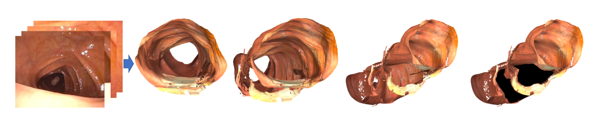
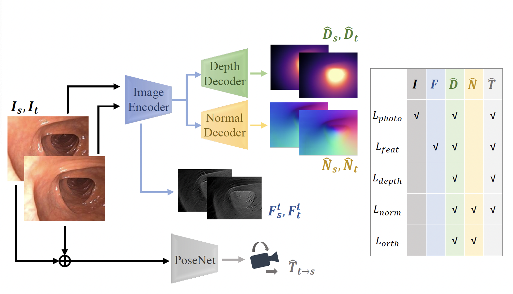
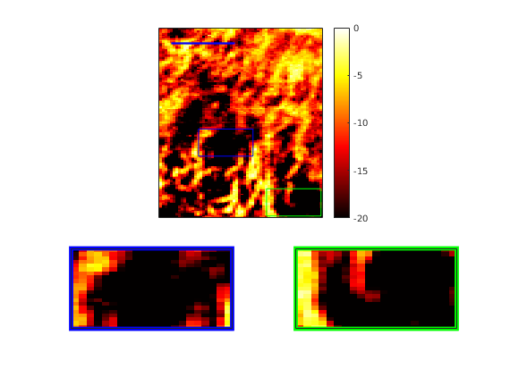
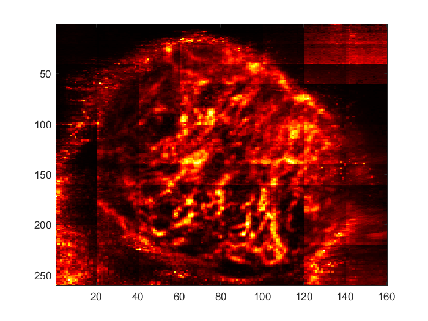

I am a Ph.D. candidate in computer science at the University of North Carolina at Chapel Hill, advised by Prof. Stephen Pizer (<a href="http://midag.cs.unc.edu">lab website</a>). My research is focused on using computer vision, shape statistics, and 3D reconstruction to improve colonoscopy as a tool for cancer screening.

I received my M.S. in computer science in 2023 from the University of North Carolina at Chapel Hill. Previously, I graduated in 2021 from Case Western Reserve University with a B.A. in physics and computer science, and from the Montgomery Blair High School Magnet in 2017. I expect to complete my Ph.D. in the 2025-26 school year, and from then pursue a career as an applied scientist.

Away from academics, you can find me hiking in the forest somewhere, tinkering with my 3D printer, or in the kitchen cooking up a pot of chili.

## Research, Publications, and Patents

<b>Leveraging Near-Field Lighting for Monocular Depth Estimation from Endoscopy Videos</b> 
Akshay Paruchuri, <b>Samuel Ehrenstein</b>, Sherry Wang, Inbar Fried, Stephen M. Pizer, Marc Niethammer, Roni Sengupta 
Accepted to <b>European Conference on Computer Vision, 2024.</b> 
[<a href="https://arxiv.org/pdf/2403.17915.pdf">PDF</a>][<a href="https://ppsnet.github.io/">Project Page</a>][<a href="https://github.com/Roni-Lab/PPSNet">Code</a>]

<i>We utilize Per-Pixel Shading (PPS) to model light reflected from surfaces in endoscopy. Using novel PPS-based, self-supervised loss functions in a teacher-student approach, and building on a pretrained DPT-Hybrid ViT model, we achieve state-of-the-art results on a variety of simulated and in-vivo clinical datasets.</i>

<b>Scribble-Supervised Semantic Segmentation for Haustral Fold Detection</b> 
<b>Samuel Ehrenstein</b>, Sarah McGill, Julian Rosenman, Stephen M. Pizer  
<b><a href="https://www.cars-int.org/cars-2023/welcome-to-cars-2023/">CARS 2023</a></b> 
[<a href="http://midag.cs.unc.edu/pubs/papers/fold_paper_revised_3.pdf">PDF</a>]
[<a href="https://github.com/qscgy/ridge-detector">Code</a>]

<i>
We employ a partial labeling technique known as scribble supervision in order to detect haustral folds in the colon during colonoscopy. In scribble supervison, only the most salient pixels of an image are labeled, enabling us to efficienty train a per-pixel semantic segmentation model on a large set of entirely in-vivo images. We ultimately achieve state-of-the-art accuracy and speed.
</i>

<b>Methods, Systems, and Computer Readable Media for Colonoscopic Blind Spot Detection</b> 
<b>S. Ehrenstein</b>, S.M. Pizer, S. Sengupta, S. Wang, Y. Zhang, J.-M. Frahm 
<b>PCT/US2024/018732.</b> Patent pending. 

Applied for a patent for our full blindspot detection system.

<b>ColDE: A Depth Estimation Framework for Colonoscopy Reconstruction</b> 
Yubo Zhang, Jan-Michael Frahm, <b>Samuel Ehrenstein</b>, Sarah K. McGill, Julian G. Rosenman, Sherry Wang, Stephen M. Pizer 
<b>arXiv 2021</b> 
[<a href="https://arxiv.org/pdf/2111.10371.pdf">PDF</a>]
[<a href="https://github.com/zhangybzbo/ColonHoleDetect">Public code</a>]

<i>
In order to address the lack of large amounts of high-quality clinical colonoscopy data with known ground-truth camera poses or pixel depths, we train a convolutional network to predict depth and pose jointly using novel self-supervised losses. This is immediately useful in improving the quality of SLAM reconstructions of the colon surface from colonoscopy video.
</i>

<b>Rank-Assisted Deep Residual Reconstruction Network for Non-Contrast Ultrasound Imaging of Blood Microvessels</b> 
<b>Samuel Ehrenstein</b>, Eric Abenojar, Reshani Perera, Agata Exner, Mahdi Bayat 
<b>IEEE International Ultrasonics Symposium 2021</b> 
[<a href="https://dx.doi.org/10.1109/IUS52206.2021.9593817">Paper</a>]

<i>
We demonstrate a two-stage hybrid approach for tissue-clutter removal in non-contrast ultrasound. First, we employ random projections of spatiotemporal data into a lower-dimensional space in order to efficeintly approximate singular-value thresholding (SVT). This removes much of the tissue clutter signal, which is low-rank, allowing us to further filter out tissue clutter using a trained neural network.
</i>

<b>Deep Learning For Accessible Non-Contrast Ultrasound Imaging of Blood Microvessels</b> 
<b>Samuel Ehrenstein</b>, Mahdi Bayat 
<b>NVIDIA GTC 2021</b> 
[<a href="https://www.nvidia.com/en-us/on-demand/session/gtcspring21-s31620/">Presentation</a>]

<i>We demonstrate the ability of a trained  neural network to remove tissue clutter in non-contrast ultrasound imaging by utilizing both spatial and temporal components of the received ultrasound echo. After a coarse filtering pass using Singular-Value Thresholding, in which the singular vectors corresponding to the largest singular values of the spatiotemporal data are masked out, we employ a single-level neural network trained on data at a variety of resolutions in order to filter out remaining tissue clutter with minimal impact on the returned signal from blood vessels.</i>

